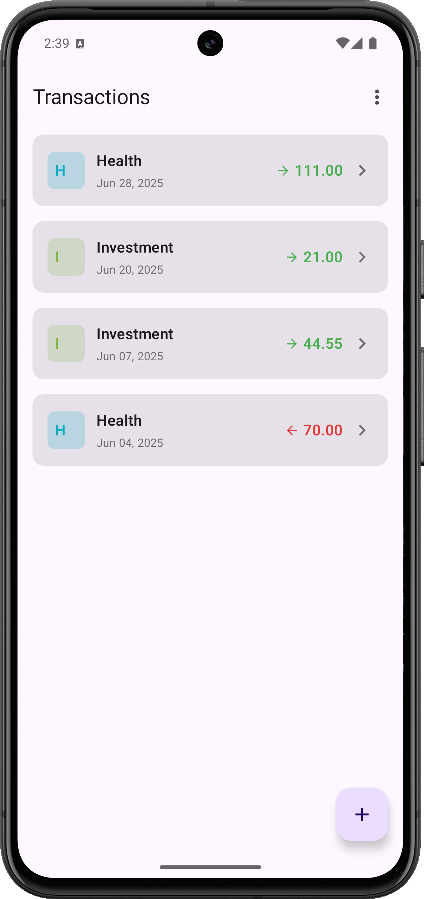
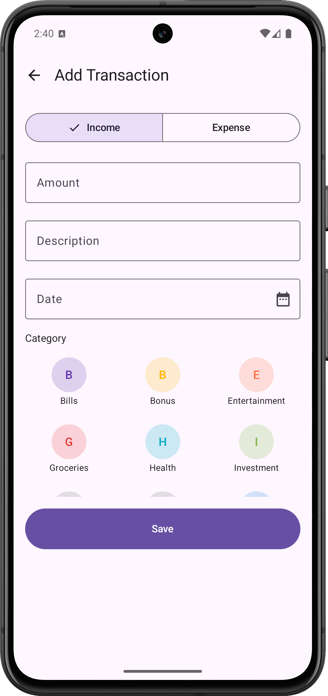
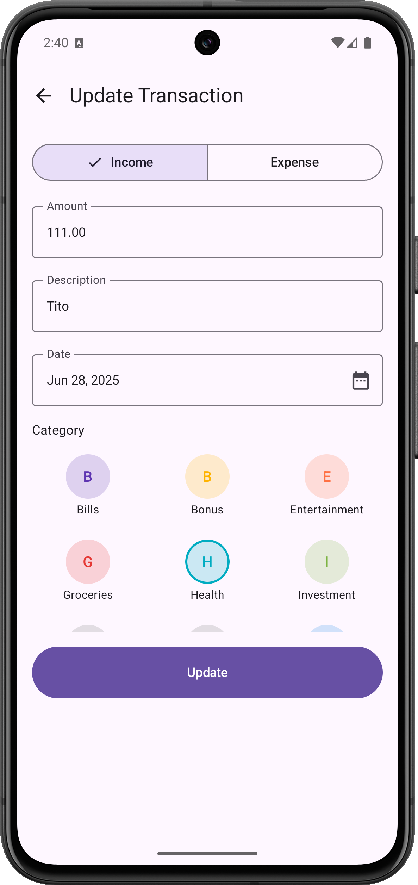
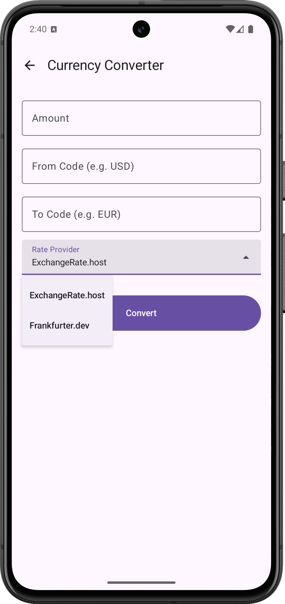

# Finance Tracker Application

This is a modern Android application built to demonstrate a robust, scalable, and modular architecture for a real-world financial tracking app.

## Core Architectural Principles

The project is built upon a foundation of modern Android development best practices and a clean, modular architecture.

-   **Clean Architecture**: The project is divided into layers (`data`, `domain`, and presentation), ensuring a strong separation of concerns. Business logic is independent of the UI and data sources.
-   **Modularization**: The application is split into multiple, independent modules (`core`, `feature`, `data`, `domain`). This improves build times, encourages code reuse, and enforces strict boundaries between different parts of the app.
-   **100% Kotlin & Jetpack Compose**: The entire application is written in Kotlin. The UI is built declaratively using Jetpack Compose.
-   **MVVM & Unidirectional Data Flow (UDF)**: The presentation layer uses the Model-View-ViewModel pattern, where each screen follows a strict UDF contract (`State`, `Event`, `Effect`) for predictable state management.
-   **Dependency Injection with Hilt**: Hilt is used to manage dependencies across the entire application, making the code more decoupled and testable.

## Screenshots

| Home                                       | Add Transaction                                |
| ------------------------------------------ | ---------------------------------------------- |
|        |         |
| **Update Transaction**                     | **Currency Conversion**                        |
|  |  |

## Module Guide

The project is organized into several modules, each with a specific responsibility. Click on a module name to view its detailed documentation.

| Module                                                | Description                                                                                                                              |
| ----------------------------------------------------- | ---------------------------------------------------------------------------------------------------------------------------------------- |
| 📂 **[`app`](./app/README.md)**                       | The main application module. It assembles all other modules into the final, runnable Android app.                                        |
| 📂 **[`core`](./core/README.md)**                     | A collection of library modules providing shared UI components, navigation, common utilities, and testing helpers.                     |
| 📂 **[`data`](./data/README.md)**                     | Implements the repository interfaces from the `domain` layer. It manages all data operations, sourcing from the local Room database.        |
| 📂 **[`domain`](./domain/README.md)**                 | The core business logic of the application. Contains use cases, business entities, and repository interfaces. It's a pure Kotlin module. |
| 📂 **[`feature/transactions`](./feature/transactions/README.md)** | A feature module that encapsulates all functionality related to creating, viewing, and managing financial transactions.                    |
| 📂 **[`currency-conversion`](./currency-conversion/README.md)** | A self-contained feature module for currency conversion. It demonstrates a Hexagonal (Ports & Adapters) architecture.                    |

</rewritten_file> 